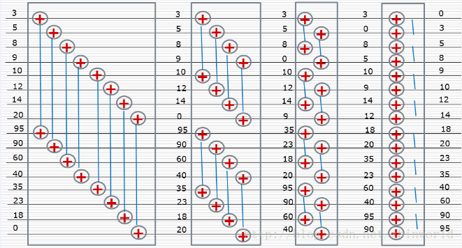
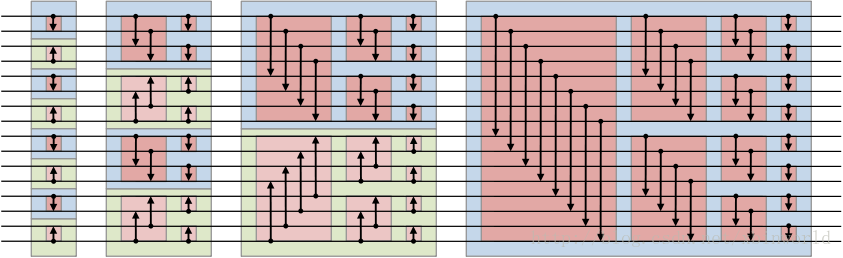
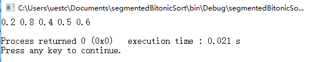
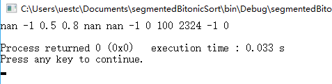

# segmentedBitonicSort

### a)算法描述

 双调排序是data-independent的排序， 即比较顺序与数据无关的排序方法， 特别适合做并行计算，例如用GPU、fpga来计算。

**1、双调序列**

双调序列是一个先单调递增后单调递减（或者先单调递减后单调递增）的序列。

**2、Batcher定理**

将任意一个长为2n的双调序列A分为等长的两半X和Y，将X中的元素与Y中的元素一一按原序比较，即a[i]与a[i+n] (i < n)比较，将较大者放入MAX序列，较小者放入MIN序列。则得到的MAX和MIN序列仍然是双调序列，并且MAX序列中的任意一个元素不小于MIN序列中的任意一个元素。

```c++
for (i=0;i<n;i++) {
    if (get(i)>get(i+n)) exchange(i,i+n);
}
```

**3、双调排序**

假设我们有一个双调序列，则我们根据Batcher定理，将该序列划分成2个双调序列，然后继续对每个双调序列递归划分，得到更短的双调序列，直到得到的子序列长度为1为止。这时的输出序列按单调递增顺序排列。类似于归并排序。

见下图，升序排序，具体方法是，把一个序列(1…n)对半分，假设n=2^k，然后1和n/2+1比较，小的放上，接下来2和n/2+2比较，小的放上，以此类推；然后看成两个(n/2)长度的序列，因为他们都是双调序列，所以可以重复上面的过程；总共重复k轮，即最后一轮已经是长度是2的序列比较了，就可得到最终的排序结果。



**4、任意序列生成双调序列**

这个过程叫Bitonic merge, 实际上也是divide and conquer的思路。 和前面sort的思路正相反， 是一个bottom up的过程——将两个相邻的，单调性相反的单调序列看作一个双调序列， 每次将这两个相邻的，单调性相反的单调序列merge生成一个新的双调序列， 然后排序（同3、双调排序）。 这样只要每次两个相邻长度为n的序列的单调性相反， 就可以通过连接得到一个长度为2n的双调序列，然后对这个2n的序列进行一次双调排序变成有序，然后在把两个相邻的2n序列合并（在排序的时候第一个升序，第二个降序）。 n开始为1， 每次翻倍，直到等于数组长度， 最后就只需要再一遍单方向（单调性）排序了。

以16个元素的array为例：

1. 相邻两个元素合并形成8个单调性相反的单调序列
2. 两两序列合并，形成4个双调序列，分别按相反单调性排序
3. 4个长度为4的相反单调性单调序列，相邻两个合并，生成两个长度为8的双调序列，分别排序
4. 2个长度为8的相反单调性单调序列，相邻两个合并，生成1个长度为16的双调序列，排序



**5、非2的幂次长度序列排序**

这样的双调排序算法只能应付长度为2的幂的数组。那如何转化为能针对任意长度的数组呢？一个直观的方法就是使用padding。即使用一个定义的最大或者最小者来填充数组，让数组的大小填充到2的幂长度，再进行排序。最后过滤掉那些最大（最小）值即可。这种方式会使用到额外的空间，而且有时候padding的空间比较大（如数组长度为1025个元素，则需要填充到2048个，浪费了大量空间）。但是这种方法比较容易转化为针对GPU的并行算法。所以一般来说，并行计算中常使用双调排序来对一些较小的数组进行排序。 如果要考虑不用padding，用更复杂的处理方法，参考[n!=2^k的双调排序网络](http://blog.csdn.net/ljiabin/article/details/8630627)。

**6、Bitonic Sort** *双调排序参考代码[来源](http://www.tools-of-computing.com/tc/CS/Sorts/bitonic_sort.htm)*

- version Ⅰ（递归）

使用sortup, sortdown, mergeup, mergedown四个函数来排序出不递减(non-decreasing)序列或者不递增(non-increasing)序列，最终递归合并成有序序列。

`void sortup(int m, int n)`将[m,m+n)区间内的n个元素按不递减顺序排列，然后使用`void mergeup(int m, int n)`将该区间的n个元素归并到整个不递减序列中。其余两个函数功能类似。

所以在`main`函数中调用可以是`sortup(0, N)`，N是元素个数。

```c++
void sortup(int m, int n) {//from m to m+n
    if (n==1) return;
    sortup(m,n/2);
    sortdown(m+n/2,n/2);
    mergeup(m,n/2);
}
void sortdown(int m, int n) {//from m to m+n
    if (n==1) return;
    sortup(m,n/2);
    sortdown(m+n/2,n/2);
    mergedown(m,n/2);
}
void mergeup(int m, int n) {
    if (n==0) return;
    int i;
    for (i=0;i<n;i++) {
        if (get(m+i)>get(m+i+n)) exchange(m+i,m+i+n);
    }
    mergeup(m,n/2);
    mergeup(m+n,n/2);
}
void mergedown(int m, int n) {
    if (n==0) return;
    int i;
    for (i=0;i<n;i++) {
        if (get(m+i)<get(m+i+n)) exchange(m+i,m+i+n);
    }
    mergedown(m,n/2);
    mergedown(m+n,n/2);
}
```

- version Ⅱ（并行，非递归）

```c++
int i,j,k;
for (k=2;k<=N;k=2*k) {
  for (j=k>>1;j>0;j=j>>1) {
    for (i=0;i<N;i++) {
      int ixj=i^j;
      if ((ixj)>i) {
        if ((i&k)==0 && get(i)>get(ixj)) exchange(i,ixj);
        if ((i&k)!=0 && get(i)<get(ixj)) exchange(i,ixj);
      }
    }
  }
}
```

### b)尝试过和完成了的加分挑战

1、不递归

**[完成]** 采用算法描述中version Ⅱ的无递归双调排序实现方式。

2、不调用函数

**[完成]** segmentedBitonicSort函数内没有调用除标准库以外的其他任何函数。

3、内存高效

**[完成]** 不使用new动态分配内存空间，采用一个大数组代替，对排序数据长度有限制，而且双调排序也不适用于数据量很大的排序，在实现上定义了1e+5长度的float型数组。

4、可并行

**[完成]** 所有时间复杂度O(n)以上的代码都写在for循环中，而且每个这样的for循环内部的循环顺序可以任意改变，不影响程序结果

5、不需内存

**[完成]** 同第三点，没有使用全局变量，符合要求。

6、绝对鲁棒

**[完成]** 包含NaN时（例如sqrt(-1.f)），保证除NaN以外的数据正确排序，NaN的个数保持不变，利用`var != var`判定是否是NAN，若是NAN则在比较的时候当作较小数。

### c)可以独立运行的源代码

**IDE:** `Code::Blocks 16.01`

**源文件:**`segmentedBitonicSort.cpp`

### d)测试数据

测试样例一：*该测试样例为没有NAN的正常情况*

```c++
// Input
float data[5]={0.8, 0.2, 0.4, 0.6, 0.5};
int seg_id[5]={0,   0,   1,   1,   1};
int seg_start[3]={0,2,5};
int n=5;
int m=2;
```

输出：



测试样例二：*该测试样例来自参考文献[3]，含有NAN的情况*

```c++
// Input
float data[12]={0.8,-1,sqrt(-1.f),0.5,100,2324,-1,sqrt(-1.f),sqrt(-1.f),0,-1,0};
int seg_id[12]={0,0,0,0,1,1,1,1,1,1,2,2};
int n=12;
int m=3;
int seg_start[4]={0,4,10,12};
```

输出：



### e)性能分析

具有`2^n`长度数据的双调排序的时间复杂度为`O(n(logn)^2)`，当数据长度`n!=2^n`时，我们需要补齐，这个对于任意n的新排序网络可以嵌入原始的对于`2^k`的双调排序网络。因此，它仍有 `log(n)*(log(n) + 1) / 2` 层，每层最多比较`n/2`次，结果是一个复杂度为`O(nlog(n)^2)`的比较器，跟原始的双调排序网络一样。

### f)测试的起始和完成时间以及实际使用的时间

该算法的难点我觉得就是在第4项加分项并行化的写法，由于双调排序已经有很多资料了，所以并行化这个问题我其实是阅读借鉴了参考文献[2]中的代码，其他几个加分点的难度不太大。1、2两项算是一起解决的，3、5两项也是，本来也就只用了C++的new，现在代替成了固定长度的大数组，第6项加一个NAN的判断条件，将NAN作为最小值来看待即可。双调排序要求数据长度为`2^n`，这里采用while循环的形式从初始值1开始不断左移1位，也就是乘2，一直到大于现在的数据长度为止。指数级增长的速度，不会耗太多运行时间。

这题直观的思路就是分成m段，然后进行m次的双调排序，后面才想起来提示中说的尽量利用输入的冗余信息，就看了下有哪些冗余信息：`seg_id, n`，那如果要用到这两个数据，就可以先将整个data数组进行一次排序，对应的seg_id也作随着data数组同样操作（保证对应位置上的组号不变），然后对seg_id进行一次双调排序，data也做同样的操作，就可以完成分段排序。

测试开始时间：2017/8/17 10:00

完成时间：2017/8/17 18:30

实际使用时间：除去中间一些杂事的时间，大概是7.5个小时，用了两个小时左右来理解算法的原理，还有查找相关的资料，从最初的递归版本到后来的可并行版本，用了一个多小时实现算法，然后用了三个小时写文档，期间一直都伴随着资料的查找等。

### 参考文献

- [[1] 三十分钟理解：双调排序Bitonic Sort，适合并行计算的排序算法](http://www.cnblogs.com/tuding/p/7335853.html)
- [[2] Bitonic Sort](http://www.tools-of-computing.com/tc/CS/Sorts/bitonic_sort.htm)
- [[3] 分段双调排序实现](http://blog.csdn.net/u014226072/article/details/56840243)

### 附：Requirement

**问题说明：**

给出分成m段 的n个浮点数，输入数据已按段号有序，但每段内部无序。用C/C++编写一个分段双调排序(Bitonic sort)函数，对每一段内部的浮点数进行排序，但不要改变段间的位置。

**接口方式：**

`void segmentedBitonicSort(float* data, int* seg_id, int* seg_start, int n, int m);`

输入数据中，data包含需要分段排序的n个float值，seg_id给出data中n个元素各自所在的 段编号。seg_start共有m+1个元素，前m个分别给 出0..m-1共m个段的起始位置，seg_start[m]保证等于n。

seg_id中的元素保证单调不下降，即对任意的i<j，seg_id[i]<=seg_id[j]。seg_id所有元 素均在0到m-1范围内。

输出结果覆盖data，保证每一段内排序，但不改变段间元素的顺序。

**注意：**

1、必须使用双调排序算法进行排序。

2、可以直接使用从网上下载的双调排序代码，但须注明出处。

**样例输入：**

```c++
float data[5]={0.8, 0.2, 0.4, 0.6, 0.5};
int seg_id[5]={0,   0,   1,   1,   1};
int seg_start[3]={0,2,5};
int n=5;
int m=2;
```

**样例输出：**

```c++
float data[5]={0.2, 0.8, 0.4, 0.5, 0.6};
```

**加分挑战（非必需）：**

1、不递归：segmentedBitonicSort函数及其所调用的任何其他函数都不得直接或间接地进行递归。

2、不调用函数：segmentedBitonicSort不调用除标准库函数外的任何其他函数。

3、内存高效：segmentedBitonicSort及其所调用的任何其他函数都不得进行动态内存分配，包括malloc、new和静态定义的STL容器。

4、可并行：segmentedBitonicSort涉及到的所有时间复杂度O(n)以上的代码都写在for循 环中，而且每个这样的for循环内部的循环顺序可 以任意改变，不影响程序结果。注：自己测试时可以用rand()决定循环顺序。

5、不需内存：segmentedBitonicSort不调用任何函数（包括C/C++标准库函数），不使用全局变量，所有局部变量都是int、float或指针类 型，C++程序不使用new关键字。

6、绝对鲁棒：在输入数据中包含NaN时（例如sqrt(-1.f)），保证除NaN以外的数据正确排序，NaN的个数保持不变。

**应提交的结果：**

a) 算法描述；

b) 尝试过和完成了的加分挑战；

c) 可以独立运行的源代码；

d) 测试数据；

e) 性能分析；

f) 测试的起始和完成时间以及实际使用的时间。

**提示：**

1. 利用好网上资源。

2. 尽量利用输入中的冗余信息。

3. 利用好位操作。